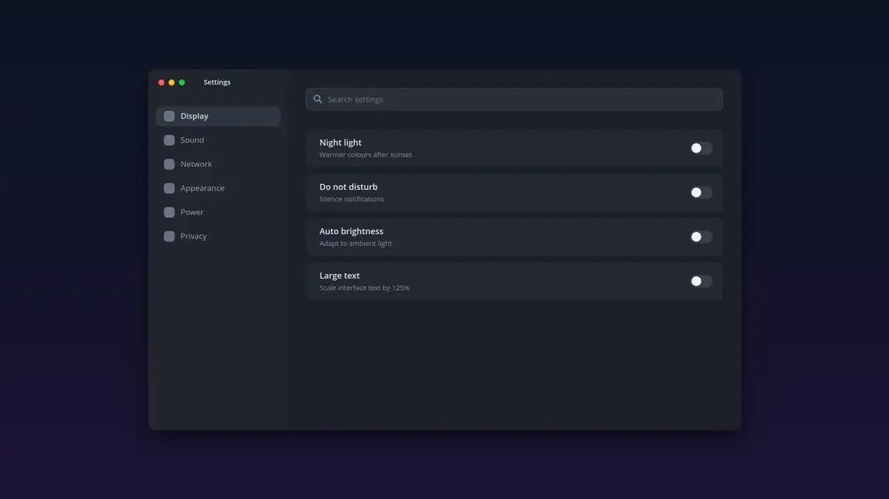

<div align="center">

# computer-use-indicator

**See when an AI agent is driving your Linux desktop.**

[](https://github.com/netherguy4/computer-use-indicator/actions/workflows/ci.yml)
[](https://github.com/netherguy4/computer-use-indicator/releases)
[](LICENSE)



<sub>Claude searches and flips a toggle, then Codex takes over. Recorded on a mock desktop · <a href="docs/demo.mp4">1080p MP4</a></sub>

</div>

When an agent uses [computer-use-linux](https://github.com/agent-sh/computer-use-linux) to click, type or look at the screen, this overlay shows it:

| | |
|---|---|
| 🖱️ **Software cursor** | A glowing arrow tinted per agent glides along an arc to every target, ripples on click and settles with a short damped sway. |
| ⌨️ **Keyboard** | Keycaps (`Ctrl` + `F`) pop up beside the cursor for key presses; typed text appears with a blinking caret. |
| 🟠 **Presence** | A soft glow along every screen edge and a pill, *Claude is using your computer · click*, on the screen in use. |
| 🫥 **Out of the way** | Click-through, hidden from the agent's own screenshots, gone 8 s after the last action. No surfaces exist while idle, so fullscreen games keep direct scanout. |

## How it works

```
agent ──MCP stdio──▶ computer-use-indicator-proxy ──▶ computer-use-linux mcp
                              │ JSON datagram per tool call
                              ▼
                     computer-use-indicator (overlay)
```

- **`computer-use-indicator`** (Rust, [libcosmic](https://github.com/pop-os/libcosmic), wgpu) creates `wlr-layer-shell` overlay surfaces on every output when an action arrives and listens on `$XDG_RUNTIME_DIR/computer-use-indicator.sock`.
- **`computer-use-indicator-proxy`** (Python 3, standard library only) sits between the agent and the server. It passes every byte through unchanged and mirrors tool calls to the overlay. If the overlay is not running, it is a plain passthrough.
  - Pointer actions wait 0.45 s before reaching the server, so the cursor lands before the real click happens.
  - `screenshot` and `get_app_state` hide a visible overlay first, so the agent never sees it in its captures.

## Install

Needs a Wayland compositor with `wlr-layer-shell`, `libxkbcommon` and Python 3.

Download `computer-use-indicator` and `computer-use-indicator-proxy` from [Releases](https://github.com/netherguy4/computer-use-indicator/releases), or build:

```sh
cargo build --release --locked
install -m755 target/release/computer-use-indicator computer-use-indicator-proxy ~/.local/bin/
```

Start the overlay with your session, for example with an autostart entry:

```ini
# ~/.config/autostart/computer-use-indicator.desktop
[Desktop Entry]
Type=Application
Name=Computer use indicator
Exec=/home/YOU/.local/bin/computer-use-indicator
NoDisplay=true
```

Then launch the MCP server through the proxy. The first argument is the agent name shown on screen.

Claude Code (`~/.claude.json`):

```json
"computer-use-linux": {
  "type": "stdio",
  "command": "/home/YOU/.local/bin/computer-use-indicator-proxy",
  "args": ["Claude", "--", "/path/to/computer-use-linux", "mcp"]
}
```

Codex (`~/.codex/config.toml`):

```toml
[mcp_servers.computer-use-linux]
command = "/home/YOU/.local/bin/computer-use-indicator-proxy"
args = ["Codex", "--", "/path/to/computer-use-linux", "mcp"]
```

Other MCP hosts work the same way: replace the server command with the proxy, the agent name, `--` and the original command.

## Options

| Variable | Read by | Effect |
|---|---|---|
| `COMPUTER_USE_INDICATOR_HIDE_TEXT=1` | proxy | Show typed text as `••••` |
| `LANG` / `LC_MESSAGES` / `LC_ALL` | both | `ru*` switches labels to Russian; English otherwise |

Agent colours: Claude terracotta, Codex blue, OpenCode green, any other name uses the desktop accent colour.

## Compatibility and limits

- Tested on COSMIC (Fedora 44, three monitors with mixed scaling). It should work on other `wlr-layer-shell` compositors (KDE Plasma, Hyprland, Sway, niri), but this is untested. GNOME has no layer-shell, so the overlay cannot run there.
- Cursor placement assumes tool coordinates are in the compositor's logical layout, which is what `computer-use-linux` uses with portal screenshots. Window-relative coordinates and element-targeted clicks (`element_index`) show the pill and glow, but the cursor does not move, because the server does not report where an element is.
- The proxy knows `computer-use-linux` tool names and arguments. Other servers need their names added in `ACT` / `LABELS`.
- Typed text is shown on screen. Set `COMPUTER_USE_INDICATOR_HIDE_TEXT=1` if agents may type secrets.

## Overlay protocol

Any process can drive the overlay with JSON datagrams on `$XDG_RUNTIME_DIR/computer-use-indicator.sock`:

```json
{"agent": "Claude", "tool": "click", "label": "click", "x": 3200, "y": 720}
{"agent": "Claude", "tool": "press_key", "label": "key press", "keys": ["Ctrl", "L"]}
{"agent": "Claude", "tool": "type_text", "label": "typing", "text": "hello"}
{"hide": true}
```

`x`/`y` are optional global logical coordinates. `tool` `click` or `drag` adds the click ripple.

## Resource use

Measured on the overlay process alone, on a 4K + 1200p + 1080p setup:

| State | CPU | RSS |
|---|---|---|
| No agent activity | 0 % | 19 MB, about 67 MB after the first show (wgpu) |
| A click every 0.8 s | about 12 % of one core | 67 MB |
| Visible, resting | about 0 % | 67 MB |

The proxy uses about 13 MB and no CPU between messages.

## Development

```sh
cargo test --locked
python3 -m unittest discover tests
```

The demo is recorded on a mock desktop in headless sway: [scripts/demo](scripts/demo).

Cursor motion research by [open-codex-computer-use](https://github.com/iFurySt/open-codex-computer-use) (MIT) informed the glide and sway.

## License

MIT
